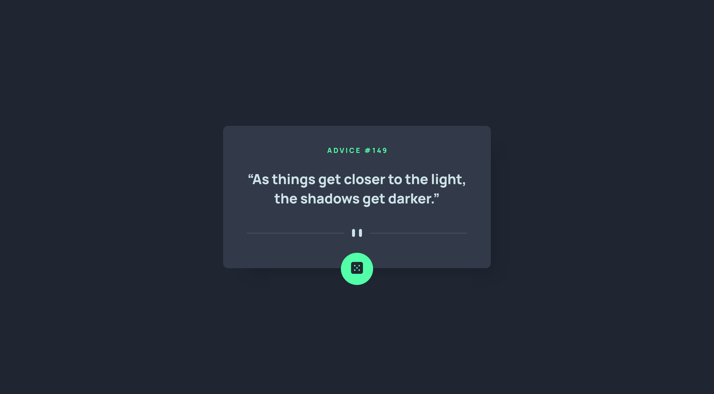
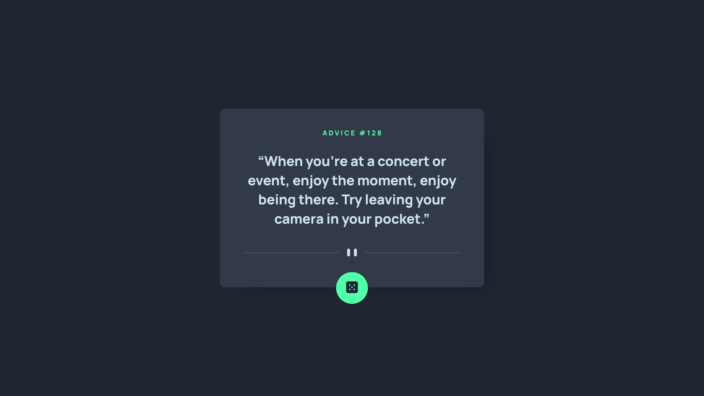

# Frontend Mentor - Advice generator app solution

This is a solution to the [Advice generator app challenge on Frontend Mentor](https://www.frontendmentor.io/challenges/advice-generator-app-QdUG-13db). Frontend Mentor challenges help you improve your coding skills by building realistic projects.

## Table of contents

- [Overview](#overview)
  - [The challenge](#the-challenge)
  - [Screenshot](#screenshot)
  - [Links](#links)
- [My process](#my-process)
  - [Built with](#built-with)
  - [What I learned](#what-i-learned)
- [Author](#author)

## Overview

### The challenge

Users should be able to:

- View the optimal layout for the app depending on their device's screen size
- See hover states for all interactive elements on the page
- Generate a new piece of advice by clicking the dice icon

### Screenshot

### Links

- Solution URL: [FrontendMentor.io](https://your-solution-url.com)
- Live Site URL: [https://ericsalvi.github.io/advice-generator-app/](https://ericsalvi.github.io/advice-generator-app/)

## My process

### Built with

- Semantic HTML5 markup
- Mobile-first workflow
- SCSS
- Axios
- Flexbox
- CSS Grid

### What I learned

I actually learned a neat little trick from @maiaflow about box shadows. Typically I'll use a generator and try to get it looking just right from the beginning. She taught me that you should set your offset first without any blur or spread that way you can easily see the poisition of the shadow. Then once it is in the right area, you can set your spread/blur. Made the box shadow on this component area super easy to implement.

## Author

- Website - [Add your name here](https://www.your-site.com)
- Frontend Mentor - [@yourusername](https://www.frontendmentor.io/profile/yourusername)
